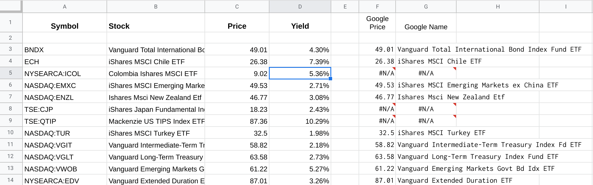

## Using through a trigger. (deprecated)
* The custom function **=CACHEFINANCE()** works well enough, but it is still not 100% (the dreaded `Loading` error)
* Using a trigger will ensure that you will **NEVER** have invalid data in your output columns.
  * However, if you provide a stock symbol not recognized by Google AND by any financial website we query - you just won't have any data in that case.
* To use a trigger, you need to create a named range called **CACHEFINANCE**.
  * Go to 'Data' ==> 'Named Ranges' and select job records as the range.  That would be the light green section in the picture below.
  * The named range can be on any sheet and not necessarily on the same sheet as the results.


* Fields in the named range are:
  * **Symbol Range**.  Specify the column range where the stock symbols are located.
  * **Attribute**.  Currently only 'Price', 'Name' and 'yieldpct' are supported.
  * **Output Range**.  Specify the column range where the financial data will be updated.
    * **WARNING** - 1)  There must be the exact same number of cells referenced here as the **Symbol Range**.
    * 2)  This updated by a Trigger function - which does not have the same restrictions as a custom function.  So if you specify a range that overwrites valid data - it will overwrite your valid data.
  * **Google Finance Range**.  This is optional, but recomended.  This column should be the finance data as retrieved by =GOOGLEFINANCE().  Again the number of cells referenced must match the number specified in the **Symbol Range**.
  * **Refresh Minutes**.  When a job is run and data is refreshed, this is the MINIMUM number of minutes to wait before running again.  
  * **Hours**.  The hours of the day when the job can run.  
    * Valid input is 0 to 23.
    * Specific hours can be listed, separated by commas.  e.g.  ```1,9,17,23```
    * Hour ranges be specified with a dash.  e.g.  ```9-17```.
    * ***NOTE**.  Google will interpret 9-17 as a date, so you will need to 'Format' ==> 'Number' ==> 'Plain Text'.
  * **Days of Week**.  Days of the week when the job can run.
    * Valid input is 0,1,2,3,4,5,6  and SUN, MON, TUE, WED, THU, FRI, SAT.
    * Days can be selected using comma separator.  e.g.  ```0,1``` (for Sunday and Monday)
    * A day range can be entered using the dash.  e.g.  ```MON-FRI```.
  * **Trigger ID**.  Just leave BLANK.  This is used by the trigger that starts so it will know which job to take.
  * **NOTE** - Google caps the number of trigger minutes per day, so don't run more often than needed.  For example, how often to Stock Names change?  

* The **Trigger Exists** displayed in the picture above, is actually a custom function:  **=CacheFinanceBoot()**
  * This check to make sure that at least one instance of **CacheFinanceTrigger** is set up in the Triggers.
  * If none are found, it will create one (assuming you have the rights - you may need to manually **Run** first).

* **Here is an example of usage - using the CacheFinance Legend above.**
  * Column 'A' is stock symbols entered by you!
  * Column 'B', 'C' and 'D' are updated by the trigger.
  * Column 'F' is entered with:  =GOOGLEFINANCE(A3, "price")
  * Column 'G' is entered with   =GOOGLEFINANCE(A3,"name")



*  Here are the suggested column titles.

| A | B | C | D | E | F | G | H |
|---|---|---|---|---|---|---|---|
| CacheFinance Legend | =CacheFinanceBoot() |
|SymbolRange |	Attribute |	OutputRange | GoogleFinanceRange | Refresh Minutes | Hours | Days of Week |	Trigger ID |

---

# Managing the Triggers

* If the custom function CacheFianceBoot() was run when the jobs were not defined yet in the named range **CACHEFINANCE**, the trigger function itself will run, not see any future jobs to create and then exit.
* If this happens, you need to carefully setup your job parameters and force CacheFinanceBoot() to run again.  You can do this by either:
  *  Open the script inside the Google Script editor, go to the Run menu and choose 'CacheFinanceBoot' from the dropdown to start.
  *  If you have inserted =CacheFinanceBoot() into a cell on your sheet, you can force it to run by typing in a new value as input.  The value does not matter, it will just force the function to run.  You could just type in a new number like **=CacheFinanceBoot(1)**.
*  If you then check 'Extensions' ==> 'Apps Script' and then click the alarm clock icon on the left, initially there will be one instance of **CacheFinanceTrigger**.  This will then create one instance for each job defined.
*  Each trigger is created and set to run ONLY ONCE at the next scheduled opportunity.  When it eventually does run, it will calculate the next time to run, create a new job, update the TRIGGER ID in the job table, and delete the old one.  Jobs cannot be modified, so it is necessary to delete and re-create.
*  When any job starts, it checks the job table on your sheet and looks at all the TRIGGER ID's.  If it finds that the ID is invalid, a trigger is started for that job item and writes this new ID back to the job table (named range CACHEFINANCE).
*  So what I am trying to say is, once everything gets started up correctly, the triggers will be created in perpetuity until:
   *  You clear out the job information line in the job table.  After the next run, no job will be created for it.
   *  If you clear Job Info in the table and the job is listed on the Trigger screen and you don't want it to run in future, you can then delete the job my clicking on the three dots on the far right of the job and select 'Delete Trigger'.


# Known Issues
* When a trigger starts, it tries to make sure that there is a running TRIGGER for every defined job - and create a trigger for each job that has an invalid ID.
* The very instant that the job starts, the ID becomes invalid and if two jobs are running at the same time, it may end up starting up a new job because it thinks one is invalid, but it really is not because it is running in another trigger, which creates a new job for itself when done.
* The end result is you may have more triggers that jobs.  So when one of these jobs wakes up, it cannot find its own ID in the table and just exits.
* I need to co-ordinate this job checking/creating process through locking.