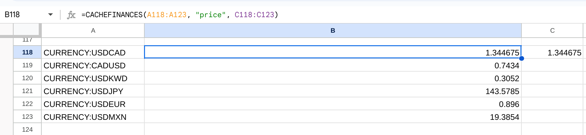

[](https://sonarcloud.io/summary/new_code?id=demmings_cachefinance)
[](https://sonarcloud.io/summary/new_code?id=demmings_cachefinance)
[](https://sonarcloud.io/summary/new_code?id=demmings_cachefinance)
[](https://sonarcloud.io/summary/new_code?id=demmings_cachefinance)
[](https://sonarcloud.io/summary/new_code?id=demmings_cachefinance)
[](https://sonarcloud.io/summary/new_code?id=demmings_cachefinance)
[](https://sonarcloud.io/summary/new_code?id=demmings_cachefinance)
[](https://deepsource.io/gh/demmings/cachefinance/?ref=repository-badge)


---

# About

<table>
<tr>
<td>

* **CACHEFINANCE** is a custom function to supplement GOOGLEFINANCE.
  * Use this for ONE symbol and ONE attribute lookup.
* **CACHEFINANCES** is a custom function similar to **CACHEFINANCE** except it is used to process a range of symbols.
* Valid **STOCK** data is always available even when GOOGLEFINANCE refuses to work.
* **Warning!!!** When a stock/ETF switches to a new exchange and you do not update the exchange code, CACHEFINANCE will continue to report the LAST quote it was able to obtain for a very long period of time.  This of course leads to portfolio valuations to drift from actual as time goes by.  You therefore need to periodically manually inspect the CACHEFINANCE price versus a quote you would have with your broker.
* GOOGLEFINANCE does not support all stock symbols.  Many unsupported google stocks can still get price/name/yield data (using web screen scraping).
* GOOGLEFINANCE does not support all currency conversions.  CACHEFINANCE will lookup any failing currency conversions if GOOGLEFINANCE fails (strangely, I am pulling this data from the google finance web site - which works most of the time)
* As you can guess from the name, data is cached so when '#N/A' appears, it uses the last known value so that it does not mess up your asset history logging/graphing.
* [All My Google Sheets Work](https://demmings.github.io/index.html)
* [CacheFinance Web site](https://demmings.github.io/notes/cachefinance.html)
    
</td>
</tr>
</table>

# Installing

* Googles guide to adding custom functions: [Google Help](https://developers.google.com/apps-script/guides/sheets/functions#creating_a_custom_function)
* Copy files manually.
* In the ./dist folder there is one file.  Only one is required.  
    * [CacheFinance.js](https://github.com/demmings/cachefinance/blob/main/dist/CacheFinance.js)
      * Caches GOOGLEFINANCE results AND does 3'rd party website lookups when all else fails.
        * This file is an amalgamation of the files in the **/src** folder.
        * Therefore do NOT use the files in **/src** folder.
* The simple approach is to copy and paste **CacheFinance.js**.
    * From your sheets Select **Extensions** and then **Apps Script**
    * Ensure that Editor is selected.  It is the **< >**
    * Click the PLUS sign beside **File** and then select **Script**
    * Click on [CacheFinance.js](https://github.com/demmings/cachefinance/blob/main/dist/CacheFinance.js), and then click on **Copy Raw Contents** which puts the file into your copy buffer.
    * Back in your Google Project, rename **Untitled** to the file name you just selected in Github.  It is not necessary to enter the .gs extension.
    * Remove the default contents of the file **myFunction()** and paste in the new content you have copied from Github (Ctrl-v).
    * Click the little diskette icon to save.
    * Change to your spreadsheet screen and try typing in any cell
    * ```=CACHEFINANCE()``` or ```=CACHEFINANCES()```.  The new function with online help should be available.


# Using
* After adding the script, it will require new permissions.
* You need to open the script inside the Google Script editor, go to the Run menu and choose 'testYieldPct' from the dropdown. This will prompt you to authorize the script  with the correct permissions.
* **Fast REST API Websites**
  * For faster stock price lookups when external finance data is used, add the key to **Apps Script** ==> **Project Settings** ==> **Script Properties**
  * The free API will have limitied functionality in all cases.  They are all throttled and may only provide end of day pricing.  You can always get a paid subscription and use that API key if your needs are greater.
    * **Finnhub**
      * Click on **Edit Script Properties** ==> **Add Script Property**.  
        * Set the property name to:  **FINNHUB_API_KEY**
        * Set the value to:  *'YOUR FINNHUB API KEY'*
          * Get your API key at:  https://finnhub.io/
    * **AlphaVantage**
      * Click on **Edit Script Properties** ==> **Add Script Property**.  
        * Set the property name to:  **ALPHA_VANTAGE_API_KEY**
        * Set the value to:  *'YOUR Alpha Vantage API Key'*
          * Get your API key at:  https://www.alphavantage.co/
    * **TwelveData**
      * Click on **Edit Script Properties** ==> **Add Script Property**.
        * Set the property name to: **TWELVE_DATA_API_KEY**
        * Set the value to:  *'YOUR Twelve Data API Key'*
          * Get your API key at:  https://twelvedata.com/
    * **CoinMarket**
      * Site used for crypto currency lookups.
      * Click on **Edit Script Properties** ==> **Add Script Property**.
        * Set the property name to: **COINMARKET_API_KEY**
        * Set the value to:  *'YOUR Coin Market API Key'*
          * Get your API key at:  https://coinmarketcap.com/api/
* Canadian Mutual Funds.
  * GOOGLEFINANCE does not support (the one I have anyway) Canadian mutual fund codes.
  * I use the Globe and Mail web site to extract the data.
    * Use the exchange code of 'CF' plus the mutual fund code like:  "CF:DYN2752"
      * e.g.  ```=CACHEFINANCE("CF:DYN2752", "PRICE")``` 


## Using as a custom function.
* The custom function **CACHEFINANCE** enhances the capabilities of GOOGLEFINANCE.
* When it is working, GOOGLEFINANCE() is much faster to retrieve stock data than calling a URL and scraping the finance data - so it is used as the default source of information.
* When GOOGLEFINANCE() works, the data is cached.
* When GOOGLEFINANCE() fails ('#N/A'), CACHEFINANCE() will search for a cached version of the data.  It is better to return a reasonable value, rather than just fail.  If your asset tracking scripts have just one bad data point, your total values will be invalid.
* Runnings custom functions (like CACHEFINANCE), can be slow.  One approach to using the function is to ONLY have it run when GOOGLEFINANCE() fails and then run CACHEFINANCE.  
  * e.g.  **=IFERROR(GOOGLEFINANCE("NEO:ZTL"),CACHEFINANCE("NEO:ZTL"))**   
* If the data cannot be found in cache, the function will attempt to find the data at various financial websites.  This process however can take several seconds just to retrieve one data point.
* If this also fails, PRICE and YIELDPCT return 0, while NAME returns an empty string.
* **CAVEAT EMPTOR**.  Custom functions are also far from perfect.  If Google Sheets decides to throw up the dreaded 'Loading' error, you are almost back to where we started with an unreliable GOOGLEFINANCE() function.
     * However, in my testing it seems to happen more often when you are doing a large number of finance lookups. 
* **SYNTAX**.
    *  ```CACHEFINANCE(symbol, attribute, defaultValue)```
    * **symbol** - stock symbol using regular GOOGLEFINANCE conventions.
    * **attribute** - three supported attributes doing 3'rd party website lookups:  
       * "price" 
       * "yieldpct"
       * "name"
      * You can specify other attributes that GOOGLEFINANCE uses, but the CacheFinance() function will not look up this data if GOOGLEFINANCE does not provide an initial default value.
      * This ATTRIBUTE name in this case is used to create our CACHE key, so its name is not important - other than when the function does a cache lookup using this key (which is made by **attribute + "|" + symbol**)
      * The following "low52" does not lookup 3'rd party website data, it will just save any value returned by GOOGLEFINANCE to cache, for the case when GOOGLEFINANCE fails to work:
    ```
        =CACHEFINANCE("TSE:ZIC","low52", GOOGLEFINANCE("TSE:ZIC", "low52"))
    ```
    * **defaultValue** - Use GOOGLEFINANCE() to supply this value either directly or using a CELL that contains the GOOGLEFINANCE value.
      * 'yieldpct' does not work for STOCKS and ETF's in GOOGLEFINANCE, so don't supply the third parameter when using that attribute.
      * Example: (symbol that is not recognized by GOOGLEFINANCE)
        *  ```=CACHEFINANCE("TSE:ZTL", "price", GOOGLEFINANCE("TSE:ZTL", "price"))```
  
    * **Special (Back Door) Commands**
      *  "TEST" -  special case.  Lists in a table results of a sanity test to third party finance sites.
         *  This will generate about twenty rows of output, so it is necessary to make sure that there is no cells with data (otherwise it fails to run).
            * ```=CACHEFINANCE("", "", "TEST")```
      * "CLEARCACHE" - special case.  Removes **ALL** CACHEFINANCE entries in script settings.  This will force a re-test of all finance websites the next time CACHEFINANCE cannot get valid data from GOOGLEFINANCE.  It will also remove entries for BLOCKED sites.
         * ```=CACHEFINANCE("", "", "CLEARCACHE")```
         * If you specify a symbol/attribute and clearcache, the long and short term cache for this data only is removed.
          * ```=CACHEFINANCE("TSE:CJP", "PRICE", "CLEARCACHE")```
      * "GET", "GETBLOCKED" - special case.  Shows the preferred site (GET) and the block site (GETBLOCKED) for the symbol/attribute combo.
        * Checking which site is doing the currency lookup:
          * ```=CACHEFINANCE("currency:CADEUR", "Price", "get")```
      * "SET", "SETBLOCKED" - special case.  Sets the preferred site (SET) and blocked site (SETBLOCKED)
        * ```=CACHEFINANCE("TSE:CJP", "PRICE", "SET", "YAHOO")```
      * "LIST - special case.  Displays the ID for each web site lookup supported.
      * "?" - special case.  Displays all supported special case commands.
      * "REMOVE" - special case.  Takes the preferred site and moves it to the blocked site.
        * ```=CACHEFINANCE("TSE:CJP", "PRICE", "REMOVE")```

## CACHEFINANCES
* **WHY USE?**
  * If you have many individual lookups using CACHEFINANCE() for price, name, yieldpct and each CACHEFINANCE() execution has to make several time consuming API calls to SHEETS, it is less efficient than using CACHEFINANCES() which uses the absolute minimum of API calls.
  * Stock prices for symbols that never get a default value (like many Canadian stocks such as TSE:ZTL), the CACHEFINANCE() function might only be executed infrequently since none of the parameter data chages - which does force the custom function to run.  Now these stocks will be updated regularly since any other stock price which IS updated in the default range, will trigger the function to run.  After the cache seconds has expired, it will use the third party website data to update the value.
* **SYNTAX**.
    *  ```CACHEFINANCES(symbolRange, attribute, defaultValueRange, cacheSeconds)```
    *  **symbolRange** - A sheets RANGE of cells that contains properly formatted stock symbols (with exchange)
       *  examples:  TSE:ZTL, NASDAQ:CXSE, NYSEARCA:EDV
    *  **attribute** - Google Finance Attribute name (not a range).
       *  Supported attributes for third party websites (used internally) are:
          *  "PRICE"
          *  "NAME"
          *  "YIELDPCT"
    *  **defaultValueRange** - A sheets range of cells that contain a default value (use GOOGLEFINANCE() to provide this).
       *  For attributes that have no default value (i.e. yieldpct), just leave empty.
    *  **cacheSeconds** - Cache Seconds.  optional (0 --> 21600).  Used primarily for symbols/attributes that NEVER provide a default value.  
       *  So for prices data attribute, this should be set fairly low (something like 1200 seconds).  This will cause actual website lookups to find the data every **X** seconds.  This operation is slow and expensive (resource wise), but it is important to have fairly recent values if you monitor your stock values during the day.
       *  For attributes like **NAME**, which almost never changes, you should set the cache value to a higher number like 21600.  There is no need to waste resources looking up websites to find data that rarely changes - and even if it does, the portfolio values would not be affected.
 *  **Examples** (from my STOCK tab that I use.)
    *  Find the yields for around 100 stocks and ETF's.
       *  ```=CACHEFINANCES(A8:A107, "yieldpct", ,21598)```
    *  Find the prices for around 100 stocks and ETF's.
       *  ```=CACHEFINANCES(A8:A107, "price", CB8:CB107, 1199)```
    *  Find the names for around 100 stocks and ETF's.
       *  ```=CACHEFINANCES(A8:A107, "Name", CC8:CC107, 21600)```
*  **LIMITATIONS**
   *  A custom function has an execution time limit of 30 seconds, so trying to do a massive number of web URL data lookups may cause the function to timeout (when Sheets is not behaving properly).  The function itself will exit as it approaches 30 seconds, so any stock not processed yet will return a blank value.  If the function is run again immediately (by changing any value of a parameter - eg. 'yieldpct' to 'YIELDPCT'), it will continue from where it left off.
   *  For any attribute that gets most of the default values from GOOGLEFINANCE, this should not be an issue.  For an attribute like **YIELDPCT**, where all stocks must be looked up at third party websites, it can be more of an issue.
   *  For my own personal sheets looking up 150 'YIELDPCT' stocks can be processed without issue.
* **EXAMPLES**
```
=CACHEFINANCES(A30:A164, "price", B30:B164, 1200)
```
  * symbol range:  A30:A164
  * attribute:     "price"
  * default range (provided by GOOGLEFINANCE) : B30:B164
  * cache seconds: 1200  

```
=CACHEFINANCES(A30:A164, "Yieldpct",,21599)
```
  * symbol range:  A30:A164
  * attribute:     "YieldPct"
  * default values: Not used (leave empty)
  * cache seconds:  21599  (for data points that don't change often, make this a higher number - max=21600 seconds)



# Roll Your Own Web Site Scraper

* Why Roll Your Own?
  * The web sites currently polled by CACHEFINANCE() don't work OR are too slow.

* Creating your lookup class.
  * You can add your own web site extraction class that will also be used to find your needed attribute.
  * You must do some programming in JavaScript and add to Apps Script in your sheet.
  * Create a new .gs file and make a class and give it an appropriate name.
    * In future if you get the latest version of CACHEFINANCE(), your work will not be overwritten.
    * The only item that will be erased is the list of sites supported, so you need to add again (see below about FinannceWebSites class)
  * You must support the following METHODS within your class.
    * **static getInfo(symbol, attribute)**
    * **static getURL(symbol, _attribute, API_KEY)**
    * **static getApiKey()**
    * **static parseResponse(html, symbol, attribute)**
    * **static getTicker(symbol)**
    * **static getPropertyValue(key, defaultValue)**
    * **static getThrottleObject()**
  * Add the new class link to be used into:  FinanceWebSites() class.
    * Ordering in the list is important.  Sites near the top are attempted before sites at the bottom of the list.  For example **AlphaVantage** is listed last because they have a very small limit on the number of calls permitted per day.
    * When a site fails (or does not support) your attribute lookup, it tries the next site in the list and the site that failed will not be tried again for a period of time.
    * You must give a unique symbolic name as well as the new object name into the array.   Currently:
```
        this.siteList = [
            new FinanceWebSite("FinnHub", FinnHub),
            new FinanceWebSite("TDEtf", TdMarketsEtf),
            new FinanceWebSite("TDStock", TdMarketsStock),
            new FinanceWebSite("Globe", GlobeAndMail),
            new FinanceWebSite("Yahoo", YahooFinance),
            new FinanceWebSite("GoogleWebSiteFinance", GoogleWebSiteFinance),
            new FinanceWebSite("AlphaVantage", AlphaVantage)
        ];
```

# Required Methods


* # **getInfo()**

```
    /**
     * Perform all steps and returns extracted data.
     * @param {String} symbol 
     * @param {String} attribute
     * @returns {StockAttributes}
     */
    static getInfo(symbol, attribute)
    {}
```

  * This method is used for testing and not for regular operations.
  * In order to process BULK api lookups, the individual steps for extraction are done separately.
    * When your object is complete, you can add the test to the class **CacheFinanceTest**
  * You should call each individual step that would be used so we can be sure all parts are working.
  * Parameters are:
    * **symbol** - expect the symbol as it would be formed for a google finance lookup.  i.e. the exchange and ticker symbol may be in a different format than what is expected at your web site.
    * **attribute** - a goole attribute like "price", "name", "yieldpct"
  * Example for Globe and Mail website calling required method.

```
    static getInfo(symbol, attribute) {
        const URL = GlobeAndMail.getURL(symbol, attribute);

        Logger.log(`getInfo:  ${symbol}.  URL = ${URL}`);

        let html = null;
        try {
            html = UrlFetchApp.fetch(URL).getContentText();
        }
        catch (ex) {
            return new StockAttributes();
        }

        return GlobeAndMail.parseResponse(html);
    }

```
***
* # **getURL()**

```
    /**
     * @param {String} symbol 
     * @param {String} _attribute
     * @param {String} API_KEY
     * @returns {String}
     */
    static getURL(symbol, _attribute) 
    {}
```

  * Creates a string that will be used to do the UrlFetchApp.fetch()   
  * Parameters are:
    * **symbol** - expect the symbol as it would be formed for a google finance lookup.  i.e. the exchange and ticker symbol may be in a different format than what is expected at your web site.
    * **_attribute** - a goole attribute like "price", "name", "yieldpct"
      * If the URL formatting depends on knowning the attribute you can use it.  Otherwise ignore.
    * **API_KEY** - The results from getApiKey() will be passed here.
      * Some web sites require your personal API KEY to be included in the URL.
  * If this web site DOES NOT support processing for this symbol/attribute - RETURN "".
    * In this case below, the Globe and Mail does not support currency conversions.
  * Example for Globe and Mail website calling required method.


```
    /**
     * @param {String} symbol 
     * @param {String} _attribute
     * @returns {String}
     */
    static getURL(symbol, _attribute) {
        if (FinanceWebSites.getTickerCountryCode(symbol) === "fx") {
            return "";
        }

        return `https://www.theglobeandmail.com/investing/markets/stocks/${GlobeAndMail.getTicker(symbol)}`;
    }
```
  * FinanceWebSites.getTickerCountryCode(symbol) - this function will return the country code.
  * It is not necessary to call FinanceWebSites.getTickerCountryCode(), it is used only if you need to know the country because it is either not supported or different URL formatting is needed.   

***
* # **getApiKey()**

```
    /**
     * @returns {String}
     */
    static getApiKey() 
    {}
```

*   If your web site lookup requires an api key, return it here, otherwise return an empty string.
*   I normally access through script properties, but you could hard code it if you are the only one going to use this new object.
*  The following is an example of getting a key from script properties:  

```
    /**
     * 
     * @returns {String}
     */
    static getApiKey() {
        return FinanceWebSites.getApiKey("FINNHUB_API_KEY");
    }
```
***
* # **parseResponse()**
```
    /**
     * @param {String} html 
     * @param {String} _symbol
     * @param {String} attribute
     * @returns {StockAttributes}
     */
     static parseResponse()
     {}
``` 
* Parse the response from the web site and return the attribute data in an object called **StockAttributes**
* Parameters are:
  * **html** - A string with html (or JSON) from the website that was called using getURL() string.
  * **_symbol** - the symbol that was used in the lookup.  Ignore if not required to extract data.
  * **attribute** - the attribute that was searched for.  Ignore if not required.

* A simple example when calling FINNHUB site.
* Regular web site extractions are more involved, but I leave that up to you.
* Generally I use regex to find what I am looking for.

```
    /**
     * @param {String} jsonStr 
     * @param {String} _symbol
     * @param {String} attribute
     * @returns {StockAttributes}
     */
    static parseResponse(jsonStr, _symbol, attribute) {
        const data = new StockAttributes();

        const hubData = JSON.parse(jsonStr);
        if (attribute === "PRICE")
            data.stockPrice = hubData.c;

        return data;
    }
```
***
* # **getTicker()**

```
    /**
     * @param {String} symbol 
     * @returns {String}
     */
    static getTicker
    {}
```

*   Manipulates the google finance formatted ticker symbol, into the format needed by your website.
*   Strictly speaking, this method is not required.  I just like to separate from getURL()   (SRP).
* Parameters are:
    * **symbol** - expect the symbol as it would be formed for a google finance lookup.  i.e. the exchange and ticker symbol may be in a different format than what is expected at your web site.
*   Example from TD Markets web site:

```
    /**
     * 
     * @param {String} symbol 
     * @returns {String}
     */
    static getTicker(symbol) {
        const colon = symbol.indexOf(":");

        if (colon >= 0) {
            const parts = symbol.split(":");
            symbol = parts[1];
        }

        const dash = symbol.indexOf("-");
        if (dash >= 0) {
            symbol = symbol.replace("-", ".PR.");
        }

        return symbol;
    }

```
***
* # **getThrottleObject()**

```
    /**
     * Get an instance of the throttling object to query if the web limit would be exceeded.
     * @returns {SiteThrottle}
     */
    static getThrottleObject()
    {}
```
  * Return null for a web site that does not need throttling.
  * Here is an example of what was done for Twelve Data:
```
    static getThrottleObject() {
        //  Basic throttle check
        const limits = [
            new ThresholdPeriod("MINUTE", 8),
            new ThresholdPeriod("DAY", 800)
        ];

        return new SiteThrottle("TWELVEDATA", limits);
    }
```

***
* # **getPropertyValue()**
  * Future expansion.  Return "" for now.

***
* # **class StockAttributes**
  * Object returned from parseResponse().
  * Properties that can be set are:
    * yieldPct
    * stockPrice
    * stockName
    * exchangeRate 
      * Both stock price and exchange rates are stored in the same private data.
      * Stock prices is rounded to two digits.
      * Exchange rate is rounded to four digits.


